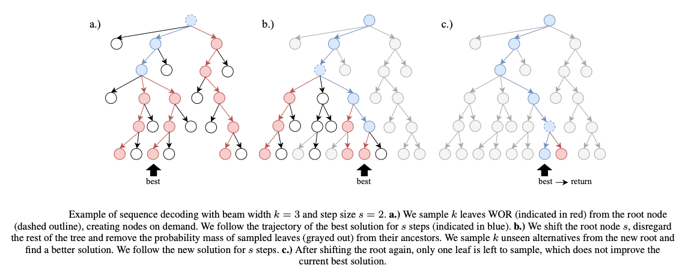

# Take a Step and Reconsider: Sequence Decoding for Self-Improved Neural Combinatorial Optimization

This is a variant of [gumbeldore](https://github.com/grimmlab/gumbeldore) in which solutions to a problem instance are decoded for data generation using the method described in the
paper (accepted for ECAI 2024) ["Take a Step and Reconsider: Sequence Decoding for Self-Improved Neural Combinatorial Optimization"](https://arxiv.org).
The code is based on a fork of [gumbeldore](https://github.com/grimmlab/gumbeldore), and we highlight differences below.



---

## Reproduce results

Similar to [gumbeldore](https://github.com/grimmlab/gumbeldore), we provide a reproduction script that loads the model checkpoints for TSP, CVRP (BQ and LEHD) and JSSP and reproduces the greedy results of the method reported in the paper. Run with

```
$ python reproduce.py
```
The reproduction script is set up to perform evaluation with four parallel workers that do model inference on the CPU. To align this with your hardware, change the variables `CUDA_VISIBLE_DEVICES` and `devices_for_eval_workers` and `beams_with_batch_sizes` at the beginning of the script. For example, to perform evaluation with 16 workers on two GPUs and a batch size of 64 for greedy evaluation, we set:

```
CUDA_VISIBLE_DEVICES = "0,1"  # Must be set for ray, as it can have difficulties detecting multiple GPUs
devices_for_eval_workers = ["cuda:0"] * 8 + ["cuda:1"] * 8  # i-th entry is the device that the i-th worker should use for evaluation
beams_with_batch_sizes = {
    1: 64  # Beam width 1 (= greedy) with a batch size of 64 per worker.
}
```

## Overview

For details on the structure of the code, we refer to the original [gumbeldore](https://github.com/grimmlab/gumbeldore) repository.
The only change in this repo is the sequence decoding method `perform_tasar` (**t**ake **a** **s**tep **a**nd **r**econsider) implemented in 
`core.incremental_sbs.IncrementalSBS`. This method is a simpler and powerful alternative to the class's method `perform_incremental_sbs`.
To use it, all you have to do is configure the Gumbeldore config dict:

### Changes made to the Gumbeldore config

In each config object, there's the dictionary `gumbeldore_config` that specifies how Gumbeldore sampling is performed. 
"Take a step and reconsider" is simpler and more intuitive to tune than the original Gumbeldore-method. To use it, set  `search_type: "tasar"` in
the dictionary (all options listed below).
Apart from the beam width, there is the (new) parameter `replan_steps` (named "step size $s$" in the paper), which defines for how many steps to commit to 
the best solution found so far before looking for alternatives. Additionally, the parameter `min_nucleus_top_p` can be set for a _constant_ p-value for Top-p (nucleus)
sampling (can be helpful during inference). 
Due to the simplicity when setting `search_type` to `tasar`, many parameters in `gumbeldore_config` become obsolete. We list all Gumbeldore config parameters below with their description and highlighted our changes in **bold**:

- `active_search` [str]: Optional string, defaults to `None`. If given, the instances for which solutions are sampled are not created randomly, but loaded from the given path. Can be used for a kind of active search, where the model is finetuned to the given instances at hand. This had no relevance in the paper.
- `use_best_model_for_generation` [bool]: If this is True - which is the way the paper uses it - the current best greedy model is used for trajectory generation. If False, simply the current model in each epoch is used.
- `append_if_not_new_best` [bool]: If True (as in paper), we don't empty the dataset after an epoch if the model has not improved. For debugging purposes on new problem classes, it can be helpful to turn this off until a good balance of number of instances/solution quality/training time was found, so that the model does not overfit to the generated data.
- `devices_for_workers` [List[int]]: List of devices where the i-th data generation worker uses the i-th device. Length of the list specifies number of workers then.
- `num_instances_to_generate` [int]: Number of instances to generate in each epoch. For JSSP, see the corresponding config, as it's structured a bit differently.
- `destination_path` [str]: Path to save the generated pickle with the instances and best found solution.
- `batch_size_per_worker` [int]: Batch size for each worker on a GPU. For JSSP, as above, see comments in config file.
- `batch_size_per_cpu_worker` [int]: Batch size for each worker on a CPU (usually smaller than for GPU, e.g., 1).
- `search_type` [str]: Sampling and policy update type. **Set to "tasar" for "Take a step and reconsider".** Must be "wor" (sample without replacement using round-wise SBS), "gumbeldore" (our method), or "theory_gumbeldore" (locally estimated advantage with theoretical policy improvement).
- `beam_width` [int]: Beam width k for Stochastic Beam Search in each round.
- `num_rounds` [int]: **Not needed for 'tasar'**. Number of sampling rounds.
- `pin_workers_to_core` [bool]: Defaults is False. If True, workers are pinned to single CPU threads, which can help with many workers on the CPU to prevent them from jamming each other with their numpy and pytorch operations.
- `advantage_constant` [float]: **Not needed for 'tasar'**. Policy update step size 'sigma' in the paper. For policy_improvement, we update the logits by adding the normalized advantage times `advantage_constant`. This should be tuned manually specifically to the problem at hand.
- `min_max_normalize_advantage` [bool]: **Not needed for 'tasar'**. If True, we perform a min max normalization on the advantages so the highest/lowest advantage is 1/-1. Default is False.
- `expected_value_use_simple_mean` [bool]: **Not needed for 'tasar'**. If True, we do not compute the expected value using Gumbels and importance sampling, but simply calculate the arithmetic mean of the leaf outcomes. Defaults to False.
- `use_pure_outcomes` [bool]: **Not needed for 'tasar'**. If True, we do not subtract the expected value from the actual outcomes, but simply return the outcome uncentered. This can be desirable in, e.g., a board game situation, where we want to value wins/losses regardless of the expected value of the trajectories. In particular,                we only use it for Gomoku.
- `normalize_advantage_by_visit_count` [bool]: **Not needed for 'tasar'**. If True, we divide the accumulated advantage of a node by its visit count. This shifts the search method further towards a Gumbel AlphaZero-type update. Can be beneficial in conjunction with `use_pure_outcomes` set to True. Can be used for Gomoku. For the paper, we use it nowhere.
- `perform_first_round_deterministic` [bool]: **Also valid for 'tasar'. If True, the first solutions are found with deterministic beam search. After following the best solution for given number of steps, falls back to sampling withour replacement for alternatives**. If True, the first Gumbeldore round is a simple deterministic beam search round, to get the exploitation of the policy "out of the system". The probability mass of the beam search trajectories is subtracted from the tree, but no advantage is propagated. In the paper's Appendix, we mention that a combination of Gumbeldore and deterministic beam search can be a powerful inference technique. This can be done with this option for example. 
- `min_nucleus_top_p` [float]: **Valid for 'tasar', where this value is taken for _constant_ Top-p sampling (no growing nucleus as in Gumbeldore)**. p_min in the paper. If smaller than 1, couples SBS with Top-p (nucleus) sampling, where we increase p linearly to 1 starting from `min_nucleus_top_p` over the rounds.
- `replan_steps` [int]: **New parameter for 'tasar'. Defines the 'step size $s$', i.e. for how many actions the best solution should be followed before sampling unseen alternatives.**

